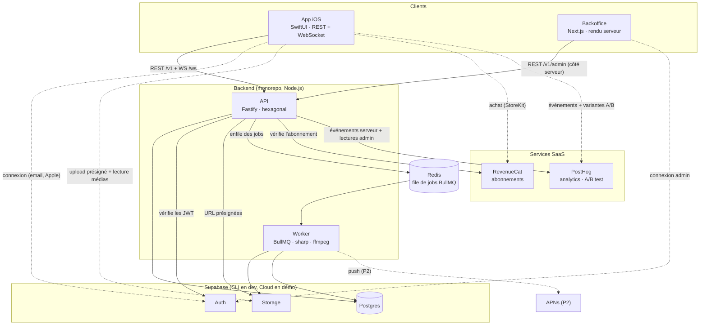
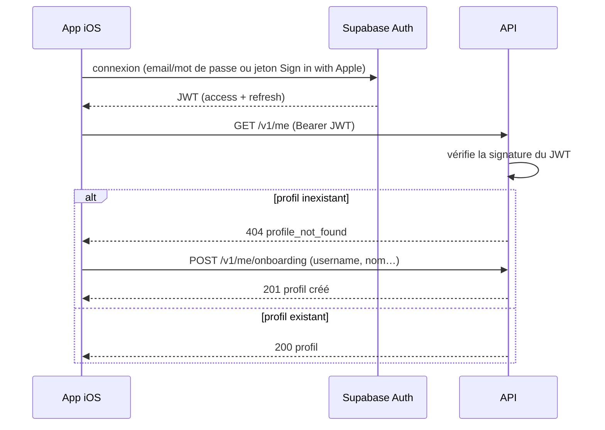
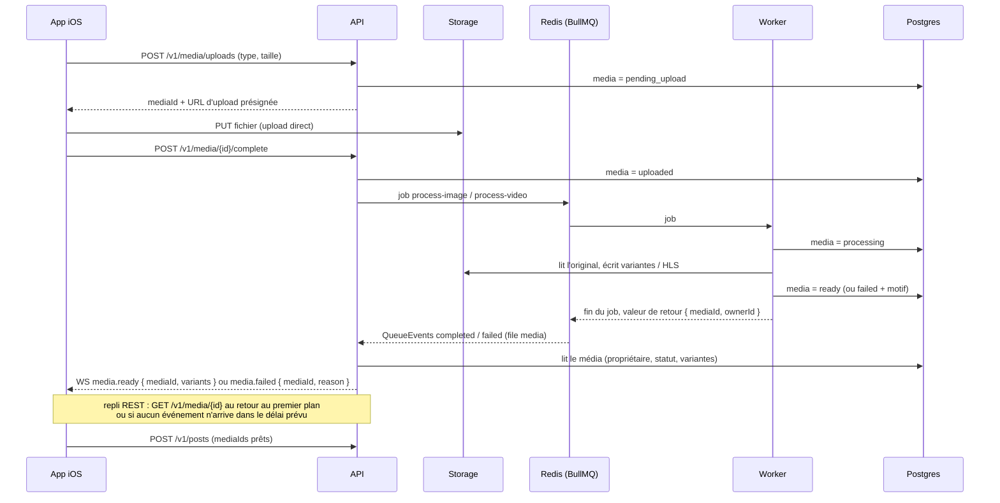
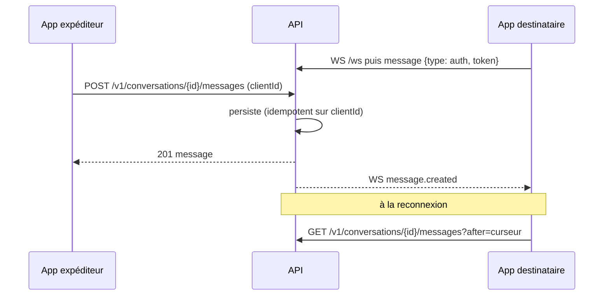
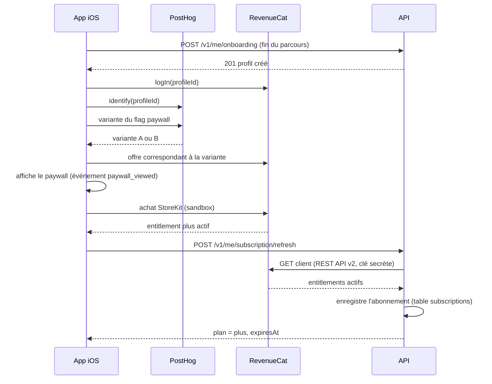

# 02 — Architecture globale

## 1. Vue d'ensemble



| Composant | Rôle | Parle à |
|---|---|---|
| App iOS | Interface utilisateur | API (toute la logique), Supabase Auth (connexion), Supabase Storage (upload présigné, lecture des médias), RevenueCat (achat), PostHog (événements, variantes A/B) |
| Backoffice | Modération, administration, analytics | API (`/v1/admin/*`) depuis le serveur Next.js ; Supabase Auth (session admin) |
| API | Toute la logique métier, autorisation, contrat | Postgres, Auth (vérification JWT), Storage (URL signées), Redis (enfilage), RevenueCat (statut d'abonnement), PostHog (événements serveur, requêtes pour le backoffice) |
| Worker | Traitements lourds et tâches planifiées | Redis (consommation), Storage, Postgres, APNs (P2) |
| Postgres | Source de vérité des données | — |
| Supabase Auth | Identités et JWT | — |
| Supabase Storage | Fichiers (originaux, variantes, HLS) | — |
| Redis | File de jobs uniquement (pas de cache) | — |
| RevenueCat (SaaS) | Achats StoreKit, entitlements, offres du paywall | — |
| PostHog (SaaS, cloud) | Stockage des événements, feature flags, expériences A/B | — |

## 2. Principes

1. **L'API est la seule porte d'entrée vers les données.** Aucun client ne lit ni n'écrit dans Postgres directement. Les deux exceptions encadrées sont la connexion (Supabase Auth) et le transfert des fichiers (Storage, via URL présignées ou URL publiques).
2. **Supabase est une infrastructure, pas un backend.** On n'utilise ni l'API de données automatique (PostgREST) côté client, ni Supabase Realtime.
3. **Le contrat OpenAPI est la source de vérité** des échanges. On modifie la spec d'abord, on régénère, puis on implémente.
4. **Les traitements lourds ne tournent jamais dans l'API.** Tout ce qui dépasse quelques centaines de millisecondes passe par un job.
5. **Le WebSocket notifie, il n'est jamais la source de vérité.** Toute donnée reçue en temps réel est récupérable par REST.
6. **Les SDK tiers de l'app ne touchent jamais à nos données.** Le SDK RevenueCat gère l'achat et le SDK PostHog envoie des événements et lit les variantes A/B. Aucun des deux n'accède à Postgres. Les droits d'accès (abonnement) sont toujours revérifiés par l'API.

> ⚠️ **Sécurité Supabase** : Supabase expose par défaut le schéma `public` via son API de données. Il faut **désactiver cette exposition** ou **activer RLS sans aucune policy** (refus total) sur toutes nos tables. Sans cela, la clé publique présente dans l'app permet de lire la base en contournant l'API.

## 3. Flux principaux

### 3.1 Authentification



- Le profil applicatif est créé par un **endpoint d'onboarding explicite**, pas par un trigger en base.
- L'API refuse toute requête d'un compte `suspended` ou `banned` (`403 account_suspended`), sauf la lecture de son statut (`GET /v1/me`) et la suppression du compte (`DELETE /v1/me`).
- Backoffice : même principe, session stockée en **cookie httpOnly** (`@supabase/ssr`), rôle admin vérifié par l'API.

### 3.2 Publication d'un média



- Le worker **revalide le fichier réel** (type détecté, dimensions, durée via `ffprobe`). Les déclarations du client ne font pas foi.
- Le post n'est créé que lorsque tous ses médias sont `ready`. L'app gère l'attente via son gestionnaire d'upload en arrière-plan.
- **Notification de fin de traitement (P1)** : l'API s'abonne aux `QueueEvents` BullMQ de la file `media` (`completed`, `failed`) et pousse au propriétaire du média un événement WebSocket `media.ready` ou `media.failed` via le port `RealtimePublisher`. Aucune brique supplémentaire : le mécanisme s'appuie sur la file de jobs existante, pas sur un canal pub/sub séparé. Si le WebSocket est fermé, l'événement est perdu et l'app rattrape l'état par `GET /v1/media/{id}`. En P0, avant la mise en place du WebSocket, l'app interroge ce endpoint.

### 3.3 Lecture des médias

- L'app lit les images (variantes) et les vidéos (playlist HLS) **directement depuis Storage**. `AVPlayer` lit HLS nativement.
- Médias publics (posts, reels, stories, avatars) : bucket public, chemins en UUID non devinables.
- Médias privés (images de DM, instants) : bucket privé, **URL signées de courte durée** délivrées par l'API après contrôle d'accès.

### 3.4 Messages privés



- **Envoi par REST** (validé par le contrat, idempotent grâce au `clientId` généré par l'app).
- **Réception par WebSocket**, rattrapage par REST après reconnexion.
- Authentification du WebSocket par un **premier message**, jamais par un token dans l'URL (il finirait dans les logs).
- Une seule instance d'API (en dev comme en démo) : diffusion via un broker en mémoire, derrière un port `RealtimePublisher` (remplaçable par Redis pub/sub plus tard).

### 3.5 Modération

1. L'app envoie un signalement (`POST /v1/reports`).
2. Le backoffice liste les signalements (`GET /v1/admin/reports`) et en traite un : suppression logique du contenu ou classement.
3. L'API écrit l'action dans le **journal d'audit**, puis enfile un job de purge des fichiers concernés.

### 3.6 Tâches planifiées (jobs récurrents BullMQ)

| Job | Fréquence | Rôle |
|---|---|---|
| `purge-orphan-media` | Toutes les heures | Supprime les médias jamais attachés après 24 h (uploads abandonnés) |
| `purge-account` | À la demande + quotidien | Purge les données et fichiers d'un compte supprimé |
| `purge-instants` (P3) | Toutes les heures | Supprime les fichiers des instants ouverts par tous ou expirés |

Les stories expirées ne sont **pas** supprimées : elles sont archivées (filtre `expires_at`), ce qui permet les stories à la une.

### 3.7 Onboarding et abonnement Clone Plus



- **L'API fait foi** pour les droits : un avantage Plus (story 48 h, vue anonyme…) n'est accordé que si la table `subscriptions` indique un abonnement actif. Le statut renvoyé par le SDK ne sert qu'à l'affichage.
- **Pas de webhooks RevenueCat** : le rafraîchissement à la demande fonctionne dans les deux environnements, y compris en dev local sans URL publique. Les webhooks restent une amélioration possible sur l'environnement de démo. L'app déclenche le rafraîchissement après un achat, une restauration et au lancement. L'API ne rappelle pas RevenueCat si la dernière vérification date de moins de 5 minutes.
- L'identifiant client RevenueCat est l'identifiant de profil. Aucun email n'est transmis.
- Le paywall propose **Restaurer les achats** et renvoie vers la gestion de l'abonnement Apple (exigences App Store).

### 3.8 Analytics et A/B test

| Source | Événements | Rôle |
|---|---|---|
| App iOS (SDK PostHog) | Écrans et étapes de l'onboarding, `paywall_viewed`, `purchase_started`, `purchase_completed`, `purchase_cancelled`, actions principales | Comportement dans l'app, entonnoirs |
| API (port `AnalyticsTracker`) | Faits métier confirmés : `profile_created`, `post_created`, `subscription_activated` | Données fiables, indépendantes de l'app |

- Nommage des événements : `objet_action` en `snake_case`, au passé. Propriétés sans donnée personnelle.
- `distinct_id` = identifiant de profil, fixé par `identify` dès la création du profil (avant le paywall, pour que la variante reste la même pour l'utilisateur).
- **A/B test** : expérience PostHog sur un feature flag à plusieurs variantes. L'app lit la variante et choisit l'offre RevenueCat ou la présentation du paywall correspondante. PostHog enregistre automatiquement l'exposition. Métrique principale : `purchase_completed`.
- **Backoffice** : pas de duplication. L'entonnoir, les inscriptions, les abonnés Plus actifs et les résultats de l'A/B test se consultent directement dans l'interface PostHog ; la page Analytics du backoffice se limite à un lien « Ouvrir dans PostHog ».
- L'envoi d'un événement serveur ne bloque jamais une requête : un échec PostHog est journalisé et ignoré.

## 4. Contrat partagé

`packages/contract/openapi.yaml` décrit tous les endpoints REST **et** les événements WebSocket (sous forme de schémas). Il génère :

| Cible | Outil |
|---|---|
| Client Swift | `swift-openapi-generator` |
| Types de l'API | `openapi-typescript` |
| Client du backoffice | `openapi-typescript` + `openapi-fetch` |

## 5. Organisation du repo

```
clone-instagram/
├── apps/
│   ├── api/            # Fastify, hexagonal (+ Dockerfile pour Railway)
│   ├── worker/         # consommateurs BullMQ (+ Dockerfile avec ffmpeg)
│   └── backoffice/     # Next.js
├── packages/
│   ├── contract/       # openapi.yaml + types générés
│   └── db/             # schéma Drizzle, migrations, seed (partagé API + worker)
├── ios/                # projet Xcode
├── supabase/           # config.toml de la CLI Supabase
├── docker-compose.yml  # Redis (dev)
├── .env.example
├── CLAUDE.md           # conventions globales pour l'IA
└── docs/
    ├── cahier-des-charges/  # ce cahier des charges
    └── adr/                 # décisions d'architecture (ADR) et agent ADR
```

Le domaine et les use cases vivent dans `apps/api`. Le worker importe uniquement `packages/db` et ses propres adapters : il ne porte pas de logique métier (voir 06).

## 6. Environnements

Deux environnements, même code, même architecture. Seule la configuration change.

| Élément | Dev (local) | Démo (hébergée) |
|---|---|---|
| Postgres, Auth, Storage | Supabase CLI : `supabase start` | **Supabase Cloud** (projet dédié à la démo) |
| API | `pnpm dev` | **Railway**, service `api` (Dockerfile) |
| Worker | `pnpm dev` | **Railway**, service `worker` (Dockerfile incluant ffmpeg) |
| Redis | `docker compose up -d` | **Railway**, service Redis |
| Backoffice | `pnpm dev` | **Vercel** |
| App iOS | Xcode, `Local.xcconfig` | Xcode, `Demo.xcconfig` (HTTPS) |

**Déploiement de la démo :**

- Railway et Vercel déploient automatiquement la branche `main` ; une tranche n'est terminée que lorsqu'elle fonctionne sur la démo.
- Le squelette (API `/health`, worker, backoffice, app connectée) est déployé **dès le début du projet**, pas à la fin, pour découvrir les problèmes de déploiement tôt.
- Les migrations Drizzle sont appliquées sur Supabase Cloud avant le démarrage de la nouvelle version de l'API.
- Supabase Cloud se configure comme le local : exposition du schéma `public` désactivée ou RLS sans policy, buckets identiques, fournisseur Apple.

**Pièges du dev local :**

- **L'iPhone ne peut pas atteindre `localhost`.** Pour tester sur iPhone en dev, l'API et Supabase doivent être joignables via l'IP locale du Mac, y compris les URL publiques générées par Supabase Storage. Sinon, on teste sur le simulateur ou directement sur la démo.
- **Côté iOS** : exception ATS `NSAllowsLocalNetworking` et permission réseau local (`NSLocalNetworkUsageDescription`) **uniquement dans la configuration Local** ; la démo est en HTTPS et n'en a pas besoin.
- **ffmpeg** doit être installé sur la machine qui exécute le worker en dev ; en démo, il est inclus dans l'image Docker du worker.

## 7. Gestion des secrets

- Fichiers `.env` **non versionnés** ; un `.env.example` versionné liste les variables sans valeurs.
- En démo, les secrets sont saisis dans les variables d'environnement de Railway et de Vercel, jamais dans le repo ni dans les Dockerfiles.
- La clé `service_role` de Supabase n'est présente **que** dans l'API et le worker.
- L'app iOS et le navigateur ne reçoivent que la clé publique et les URL.
- Les clés APNs (P2) et la configuration Sign in with Apple restent hors du repo.
- La clé secrète RevenueCat et la clé personnelle PostHog ne sont présentes **que** côté serveur : l'API, et le worker pour le job de purge. L'app ne reçoit que la clé publique RevenueCat et la clé projet PostHog, qui sont faites pour être embarquées.
