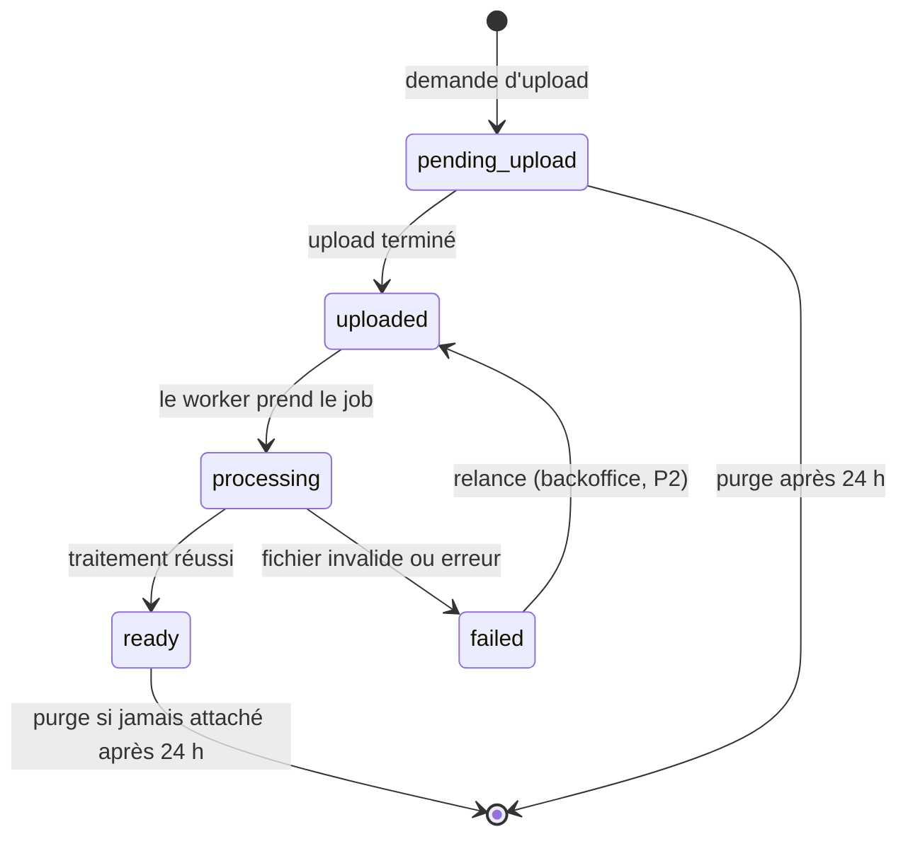
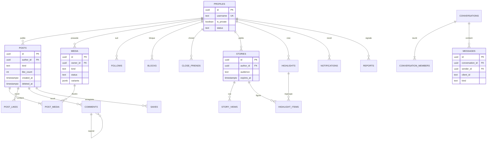

# 03 — Entités métier et modèle de données

## 1. Carte fonctionnelle centrée utilisateur

L'utilisateur est l'acteur principal. Ses actions se répartissent en trois axes :

| Axe | Fonctionnalités |
|---|---|
| **1. Publier** | Post (photo / carrousel), reel, story, story à la une, note, instantané |
| **2. Interagir** | Message, like, commentaire, republication, enregistrement, collaboration, mention, abonnement (+ demandes), ami proche, signalement, blocage |
| **3. Gérer et consulter** | Profil, paramètres (compte privé, bloqués, amis proches, suppression du compte), activité, recherche |

> **Important** : cette carte décrit le **produit**. Elle ne doit pas devenir le modèle de données. Dans le code et en base, l'utilisateur n'est qu'un **identifiant référencé** par des modules indépendants. Une entité `User` qui porterait tout deviendrait une « god entity » modifiée par tous les modules.

## 2. Modules métier (bounded contexts)

| Module | Responsabilité | Tables principales |
|---|---|---|
| `identity` | Profil, statut du compte, rôles admin | `profiles`, `admin_roles` |
| `social` | Abonnements, demandes, blocages, amis proches | `follows`, `follow_requests`, `blocks`, `close_friends` |
| `media` | Intentions d'upload, statut de traitement, variantes | `media` |
| `posts` | Posts et reels, médias associés, collaborations, republications | `posts`, `post_media`, `post_collaborators`, `reposts`, `post_media_tags` |
| `engagement` | Likes, commentaires, enregistrements, mentions | `post_likes`, `comments`, `comment_likes`, `saves`, `mentions` |
| `feed` | Lecture des fils (accueil, reels, explorer) | aucune table propre (lecture) |
| `ephemeral` | Stories, vues, stories à la une, notes, instants | `stories`, `story_views`, `highlights`, `highlight_items`, `notes`, `instants`, `instant_recipients` |
| `messaging` | Conversations, messages, lecture | `conversations`, `conversation_members`, `messages` |
| `activity` | Notifications in-app | `notifications` |
| `moderation` | Signalements, actions admin, audit | `reports`, `admin_audit_log` |

**Deux identités distinctes :**
- `auth.users` : géré par Supabase Auth (email, fournisseur, mot de passe). **On ne modifie jamais le schéma `auth`.**
- `profiles` : notre table, avec `id` = identifiant Supabase Auth.

## 3. Conventions de modélisation

| Sujet | Règle |
|---|---|
| Identifiants | UUID v7 générés par l'application (triés dans le temps, favorables aux index) |
| Dates | `timestamptz`, stockées en UTC |
| Suppression | Logique (`deleted_at`) pour posts, commentaires, stories ; **réelle** lors d'une suppression de compte (RGPD) |
| Polymorphisme | Interdit dans les clés étrangères : une table de like par cible, et colonnes nullables + `CHECK` quand une ligne peut viser plusieurs types |
| Compteurs | Dénormalisés, mis à jour par incrément atomique **dans la même transaction** que l'écriture |
| Username | 1 à 30 caractères `[a-z0-9._]`, stocké en minuscules, unique |
| Énumérations | Type `text` + contrainte `CHECK` (plus simple à migrer qu'un `enum` Postgres) |

## 4. Entités et règles

### 4.1 Identity

**`profiles`** : `id`, `username`, `full_name`, `bio`, `avatar_media_id`, `is_private`, `status` (`active` | `suspended` | `banned`), `follower_count`, `following_count`, `post_count`, `created_at`, `updated_at`.

**`admin_roles`** : `user_id`, `role` (`admin`), `created_at`.

Règles :
- Un compte `suspended` ou `banned` ne peut plus écrire ; son contenu n'est plus visible des autres.
- Passer un compte de privé à public **accepte automatiquement** les demandes d'abonnement en attente.
- Suppression de compte : suppression immédiate de l'accès, puis purge des données et fichiers par un job.

### 4.2 Social

- **`follows`** (`follower_id`, `followee_id`, `created_at`) — clé primaire composite. On ne peut pas se suivre soi-même.
- **`follow_requests`** (`requester_id`, `target_id`, `created_at`) — uniquement vers un compte privé. Accepter crée un `follow` et supprime la demande.
- **`blocks`** (`blocker_id`, `blocked_id`, `created_at`).
- **`close_friends`** (`owner_id`, `friend_id`, `created_at`).

**Blocage** : bloquer supprime les abonnements et demandes **dans les deux sens**. Ensuite, les deux comptes deviennent mutuellement invisibles : profil, contenus, recherche, commentaires, mentions, messages.

### 4.3 Politique de visibilité (règle transversale)

Le blocage, le compte privé et les audiences touchent **tous** les modules. La règle est centralisée dans une politique unique du domaine, appelée par chaque use case de lecture. Aucune requête ne réimplémente ces filtres à la main.

| Question | Règle |
|---|---|
| `canViewProfile(viewer, owner)` | Aucun blocage dans un sens ou dans l'autre, et `owner.status = active` |
| `canViewContent(viewer, owner)` | `canViewProfile`, et (compte public **ou** `viewer` = `owner` **ou** `viewer` suit `owner`) |
| `canViewStory(viewer, story)` | `canViewContent`, et (audience `everyone` **ou** `viewer` dans les amis proches de l'auteur) |
| `canMessage(sender, recipient)` | `canViewProfile` (P2 : demande de message si le destinataire ne suit pas l'expéditeur) |
| `isMutual(a, b)` | `a` suit `b` **et** `b` suit `a` (utilisé par les notes et instants) |

### 4.4 Media

**`media`** : `id`, `owner_id`, `kind` (`image` | `video`), `purpose` (`post` | `story` | `avatar` | `message` | `instant`), `status`, `original_path`, `mime_type`, `size_bytes`, `width`, `height`, `duration_ms`, `variants` (jsonb), `failure_reason`, `created_at`, `processed_at`.

`variants` contient :
- pour une image : les chemins des tailles générées (`thumb` 150 px, `medium` 640 px, `large` 1080 px, en WebP) ;
- pour une vidéo : le chemin de la playlist HLS maître, la miniature, la durée.

#### Machine à états



Règles :
- Seules les transitions du diagramme sont autorisées. Elles sont écrites en **mises à jour conditionnelles** (`UPDATE … SET status = 'ready' WHERE id = $1 AND status = 'processing'`), dans des fonctions partagées de `packages/db`, utilisées par l'API et le worker. Une mise à jour qui ne touche aucune ligne est une transition invalide.
- Seul le worker fait passer un média en `processing`, `ready` ou `failed`.
- Un média ne peut être attaché qu'une fois, par son propriétaire, et seulement s'il est `ready` et que son `purpose` correspond.

#### Limites de traitement (valeurs initiales, ajustables)

| Type | Entrée acceptée | Sortie |
|---|---|---|
| Image | JPEG / PNG, ≤ 20 Mo (l'app convertit le HEIC en JPEG avant envoi) | WebP 150 / 640 / 1080 px, **EXIF supprimé** |
| Vidéo (reel) | MP4 H.264 préparé par l'app, ≤ 60 s, ≤ 200 Mo | HLS 360p + 720p (H.264 / AAC, segments ~4 s), miniature |

### 4.5 Posts

**`posts`** : `id`, `author_id`, `kind` (`post` | `reel`), `caption` (≤ 2 200 caractères), `like_count`, `comment_count`, `repost_count`, `created_at`, `updated_at`, `deleted_at`.

**`post_media`** : `post_id`, `media_id`, `position` (0 à 9). Un reel a exactement un média vidéo ; un post a de 1 à 10 médias image.

Pourquoi une seule table pour posts et reels : likes, commentaires, enregistrements, mentions, collaborations et republications s'appliquent aux deux de façon identique. Deux tables doubleraient toutes les tables d'engagement.

**`post_collaborators`** (P2) : `post_id`, `user_id`, `status` (`pending` | `accepted` | `declined`), `created_at`. Le post apparaît sur le profil du collaborateur après acceptation. Limite proposée : 3 collaborateurs.

**`reposts`** (P2) : `user_id`, `post_id`, `created_at`, clé primaire composite. Visible dans l'onglet « Republications » du profil et dans le feed des abonnés.

**`post_media_tags`** (P2) : `post_id`, `media_id`, `user_id`, `x`, `y` (position relative 0–1).

### 4.6 Engagement

- **`post_likes`** (`user_id`, `post_id`, `created_at`) — clé primaire composite, incrémente `posts.like_count`.
- **`comments`** : `id`, `post_id`, `author_id`, `parent_id` (nullable, **un seul niveau** : une réponse ne peut pas avoir de réponse), `body` (≤ 2 200 caractères), `like_count`, `reply_count`, `created_at`, `deleted_at`.
- **`comment_likes`** (`user_id`, `comment_id`, `created_at`).
- **`saves`** (`user_id`, `post_id`, `created_at`) — privé, visible du seul propriétaire.
- **`mentions`** : `id`, `mentioned_user_id`, `author_id`, `post_id` | `comment_id` | `story_id` (exactement un non nul, via `CHECK`), `created_at`. Les mentions sont extraites du texte (`@username`) par le use case de création ; un utilisateur invisible pour l'auteur (blocage) n'est pas mentionné.

### 4.7 Stories et stories à la une

**`stories`** : `id`, `author_id`, `media_id`, `audience` (`everyone` | `close_friends`), `view_count`, `created_at`, `expires_at` (= `created_at` + 24 h), `deleted_at`.

- Une story est **active** tant que `expires_at > now()`. Ensuite, elle est archivée (visible par son seul auteur), jamais supprimée automatiquement.
- **`story_views`** (`story_id`, `viewer_id`, `viewed_at`) : une vue par personne, enregistrée à l'affichage. La liste des vues n'est visible que de l'auteur.
- Répondre à une story crée un message privé de type `story_reply`.
- **`highlights`** (P2) : `id`, `owner_id`, `title`, `cover_media_id`, `created_at`.
- **`highlight_items`** (P2) : `highlight_id`, `story_id`, `position`. Seules les stories de l'auteur peuvent y figurer ; leur visibilité suit alors celle du profil, et non plus l'expiration.

### 4.8 Notes (P2)

**`notes`** : `id`, `author_id`, `body` (≤ 60 caractères), `audience` (`mutuals` | `close_friends`), `created_at`, `expires_at` (+ 24 h).

- **Une seule note active par auteur** : en publier une nouvelle remplace l'ancienne.
- Affichées en haut de la messagerie, pour les destinataires autorisés par l'audience.
- Répondre à une note crée un message privé de type `note_reply`.

### 4.9 Instants (P3)

Photos prises sur le moment, envoyées en privé, visibles une seule fois. Elles vivent dans l'espace messagerie, pas dans le feed ni dans les stories.

**`instants`** : `id`, `sender_id`, `media_id`, `audience` (`close_friends` | `mutuals`), `created_at`, `expires_at` (+ 24 h).
**`instant_recipients`** : `instant_id`, `recipient_id`, `opened_at`, `reaction` (emoji, nullable).

Règles :
- Capture **par la caméra uniquement** (pas d'import depuis la galerie).
- Destinataires calculés à l'envoi selon l'audience : amis proches, ou abonnés mutuels. Pas d'envoi à tous les abonnés.
- **Visible une seule fois** : `POST /v1/instants/{id}/open` renvoie une URL signée de courte durée et enregistre `opened_at`. Un second appel est refusé. L'app masque l'image quelques secondes après ouverture.
- Non ouvert, un instant disparaît à `expires_at`.
- Aucun compteur de vues, aucun like, aucune liste publique.
- Le destinataire peut **réagir par emoji** ou **répondre par message**. La réponse est un message privé normal (`instant_reply`) qui **reste** dans la conversation après la disparition de l'instant. Seul l'expéditeur la voit.
- Le fichier est stocké dans le bucket privé et purgé une fois ouvert par tous les destinataires ou expiré.
- Limite assumée : l'app ne peut pas empêcher une capture d'écran.

### 4.10 Messaging

- **`conversations`** : `id`, `created_at`, `last_message_at`. Uniquement en tête-à-tête ; une seule conversation par paire d'utilisateurs.
- **`conversation_members`** : `conversation_id`, `user_id`, `last_read_message_id`, `status` (`active` | `request`, P2).
- **`messages`** : `id`, `conversation_id`, `sender_id`, `client_id` (unique par expéditeur, pour l'idempotence), `kind`, `body`, `media_id`, `shared_post_id`, `story_id`, `note_id`, `instant_id`, `created_at`, `deleted_at`.

| `kind` | Champs utilisés |
|---|---|
| `text` | `body` |
| `image` | `media_id` (bucket privé), `body` optionnel |
| `post_share` | `shared_post_id` |
| `story_reply` | `story_id`, `body` |
| `note_reply` (P2) | `note_id`, `body` |
| `instant_reply` (P3) | `instant_id` (mis à `NULL` à la purge), `body` |

Les références vers un contenu supprimé ou devenu invisible s'affichent comme « contenu indisponible ».

### 4.11 Activité

**`notifications`** : `id`, `recipient_id`, `actor_id`, `type`, `post_id`, `comment_id`, `story_id`, `created_at`, `read_at`.

Types : `like`, `comment`, `comment_reply`, `comment_like`, `follow`, `follow_request`, `follow_accepted`, `mention`, `collab_invite` (P2), `repost` (P2).

- Créées par les use cases **dans la même transaction** que l'action qui les déclenche.
- Pas de notification vers soi-même ni depuis un compte bloqué.
- Un unlike ou une suppression supprime la notification correspondante.
- Le regroupement (« X et 5 autres ont aimé ») est calculé à la lecture, pas stocké.

### 4.12 Moderation

- **`reports`** : `id`, `reporter_id`, cible (`post_id` | `comment_id` | `story_id` | `user_id` | `message_id`, exactement une), `reason` (`spam` | `nudity` | `harassment` | `violence` | `hate` | `other`), `details`, `status` (`open` | `resolved_removed` | `resolved_dismissed`), `created_at`, `resolved_at`, `resolved_by`.
- **`admin_audit_log`** : `id`, `admin_id`, `action`, `target_type`, `target_id`, `metadata` (jsonb), `created_at`. Écriture seule, jamais modifiée.

## 5. Schéma relationnel (vue simplifiée)



Le schéma de référence est celui de Drizzle (`packages/db`). Ce diagramme n'en est qu'une vue d'ensemble.

## 6. Le feed et ses index

### 6.1 Requête du feed d'accueil (chronologique)

Posts et reels des comptes suivis + ses propres posts, non supprimés, auteurs visibles, du plus récent au plus ancien :

```sql
SELECT p.*
FROM posts p
WHERE p.deleted_at IS NULL
  AND (p.author_id = :me
       OR p.author_id IN (SELECT followee_id FROM follows WHERE follower_id = :me))
  AND p.author_id NOT IN (SELECT blocked_id FROM blocks WHERE blocker_id = :me
                          UNION SELECT blocker_id FROM blocks WHERE blocked_id = :me)
  AND (p.created_at, p.id) < (:cursor_created_at, :cursor_id)
ORDER BY p.created_at DESC, p.id DESC
LIMIT 20;
```

La requête exacte sera écrite en Drizzle et validée avec `EXPLAIN ANALYZE` sur des données de seed. Elle exclut aussi les auteurs non actifs.

### 6.2 Index

| Index | Usage |
|---|---|
| `posts (author_id, created_at DESC, id DESC) WHERE deleted_at IS NULL` | Feed, grille du profil (index partiel : ignore les posts supprimés) |
| `posts (kind, created_at DESC, id DESC) WHERE deleted_at IS NULL` | Onglet Reels |
| `follows` PK `(follower_id, followee_id)` + index `(followee_id)` | « Qui je suis » / liste des abonnés |
| `blocks` PK `(blocker_id, blocked_id)` + index `(blocked_id)` | Politique de visibilité |
| `comments (post_id, created_at) WHERE parent_id IS NULL` | Commentaires d'un post |
| `stories (author_id, expires_at)` | Fil des stories actives |
| `messages (conversation_id, created_at DESC, id DESC)` | Historique d'une conversation |
| `notifications (recipient_id, created_at DESC)` | Onglet Activité |
| `profiles USING gin (username gin_trgm_ops)` | Recherche d'utilisateurs (`pg_trgm`) |

### 6.3 Pagination par curseur

- Curseur = couple `(created_at, id)` du dernier élément, encodé en base64 et opaque pour le client.
- Pourquoi pas `OFFSET` : si des posts sont publiés pendant le scroll, `OFFSET` produit des doublons ; et `OFFSET 1000` oblige Postgres à lire puis jeter 1 000 lignes.
- L'`id` départage deux éléments créés au même instant.

### 6.4 Évolutions possibles (hors périmètre)

- **Republications (P2)** : le feed devient l'union de deux sources (posts et republications) triée sur une « date d'activité ». C'est la raison de leur priorité P2.
- **Fan-out à l'écriture** (timelines précalculées, comme Instagram à grande échelle) : inutile à notre échelle.
