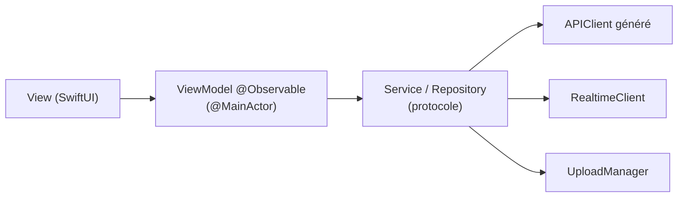

# 05 — App iOS

## 1. Stack

| Besoin | Choix | Justification |
|---|---|---|
| Langage | Swift 6, mode de concurrence strict | Sécurité des données partagées dès le départ ; isolation `@MainActor` par défaut si le réglage des nouveaux projets Xcode le propose (à vérifier) |
| UI | SwiftUI | Natif, Liquid Glass intégré aux composants système |
| Version minimale | iOS 26, compilée avec le SDK iOS 27 (D30, ADR-010) | Liquid Glass disponible depuis iOS 26 ; les API propres à iOS 27 passent par `#available` |
| Style | Liquid Glass | Composants système (tab bar, toolbars, sheets) ; `.glassEffect()` réservé aux contrôles personnalisés |
| État | Observation (`@Observable`) | Standard actuel, bien connu de l'IA |
| Réseau | Client généré par `swift-openapi-generator` + transport `URLSession` | Aucun endpoint ni champ inventé |
| Authentification | Module `Auth` de `supabase-swift` + `AuthenticationServices` (Sign in with Apple) | Seule partie du SDK Supabase utilisée |
| Images | Nuke | Cache mémoire et disque, prefetching, décodage hors du thread principal |
| Vidéo | AVFoundation (`AVPlayer`, lecture HLS native) | — |
| Capture | `PhotosPicker` (posts), AVFoundation (stories, instants) | — |
| Temps réel | `URLSessionWebSocketTask` | Pas de dépendance supplémentaire |
| Stockage sécurisé | Keychain (via le SDK Auth) | Aucun jeton dans `UserDefaults` |
| Achats | SDK RevenueCat (`purchases-ios`) + StoreKit | Imposé ; gère offres, achat, restauration et reçus sans code StoreKit à la main |
| Analytics et A/B test | SDK PostHog (`posthog-ios`) | Événements, feature flags et expériences dans un seul outil |
| Tests | Swift Testing ; XCUITest pour 2 ou 3 parcours | — |
| Qualité | SwiftLint, SwiftFormat | Style homogène malgré la génération par IA |

**Règle** : toute nouvelle dépendance doit être justifiée dans `09-decisions-risques.md`.

## 2. Architecture

### 2.1 MVVM avec `@Observable`



| Couche | Responsabilité | Interdit |
|---|---|---|
| View | Affichage, gestes, navigation déclenchée par l'utilisateur | Appels réseau, logique métier |
| ViewModel | État de l'écran, actions, gestion du chargement et des erreurs | Importer SwiftUI pour autre chose que des types de base ; connaître le client HTTP |
| Service / Repository | Accès aux données, conversion DTO → modèles de l'app | Connaître les vues |
| Core | Client API, temps réel, upload, images, design system | Dépendre des features |

Règles :
- **Un ViewModel seulement pour les écrans qui ont un état ou une logique réels** (feed, publication, conversation, profil). Une vue statique n'en a pas.
- Les services sont **injectés par protocole** (via l'environnement SwiftUI ou l'initialiseur), ce qui permet de les remplacer par des faux dans les tests et les previews.
- Les modèles de l'app ne sont pas les types générés : les services convertissent. Un changement mineur de contrat ne se propage pas dans toutes les vues.
- **Mises à jour optimistes** pour like, save, follow : l'état change immédiatement et revient en arrière si l'API échoue.

### 2.2 Organisation du projet

Une seule cible d'app, organisée en dossiers par feature. Les **dossiers synchronisés de Xcode** sont utilisés pour éviter que l'ajout de fichiers modifie le `.pbxproj`.

```
ios/CloneInstagram/
├── App/                  # point d'entrée, injection des dépendances, router racine
├── Core/
│   ├── API/              # client généré, configuration, middleware d'authentification
│   ├── Auth/             # session, Sign in with Apple
│   ├── Realtime/         # WebSocket, reconnexion
│   ├── Media/            # UploadManager, pipeline d'images, pool de lecteurs vidéo
│   ├── Navigation/       # Router, deep links
│   ├── Billing/          # SubscriptionService (RevenueCat + refresh API)
│   ├── Analytics/        # AnalyticsService (PostHog), noms d'événements, flags
│   └── Models/           # modèles de l'app
├── DesignSystem/         # couleurs, typographie, composants réutilisables
├── Features/
│   ├── Onboarding/
│   ├── Paywall/
│   ├── Feed/
│   ├── Post/             # détail, commentaires, création
│   ├── Reels/
│   ├── Stories/
│   ├── Profile/
│   ├── Search/
│   ├── Messages/
│   ├── Activity/
│   └── Settings/
└── Resources/            # assets, .xcconfig par environnement
```

Chaque feature contient ses vues, ViewModels et services propres. Une feature n'importe pas une autre feature ; ce qui est partagé descend dans `Core` ou `DesignSystem`.

### 2.3 Navigation

- `TabView` avec les onglets d'Instagram. Proposition : Accueil, Reels, Messages, Recherche, Profil, avec la création (+) dans la barre du haut de l'accueil. **À aligner sur l'app actuelle analysée.**
- Une `NavigationStack` par onglet, pilotée par un `Router` (`NavigationPath`) : les deep links et les futures notifications push ouvrent le bon écran.
- Création, viewer de stories et viewer d'instants : présentations plein écran.

## 3. Composants techniques clés

### 3.1 UploadManager

- File d'uploads persistée : une publication survit à la fermeture de l'écran et à la mise en arrière-plan.
- `URLSession` en configuration **background** pour l'envoi vers l'URL présignée.
- Préparation avant envoi :
  - image : conversion HEIC → JPEG, redimensionnement à 2 160 px maximum ;
  - vidéo : export MP4 H.264 via `AVAssetExportSession`, découpe à 60 s maximum.
- Enchaîne `uploads` → envoi → `complete` → attente du statut → création du post.
- Attente du statut (P1) : l'`UploadManager` attend l'événement WebSocket `media.ready` ou `media.failed`. Il rattrape l'état par `GET /v1/media/{id}` au retour au premier plan, et si aucun événement n'arrive dans un délai raisonnable. En P0, avant le WebSocket, il interroge ce endpoint.
- Affiche un bandeau « Publication en cours » avec progression, et un état d'échec avec relance.

### 3.2 Feed et images

- `LazyVStack` ou `List` avec **prefetching** des images suivantes via Nuke.
- Toujours demander la variante adaptée à la taille d'affichage (`thumb` pour les grilles, `large` pour le feed).
- Pas d'`AsyncImage` (pas de cache disque maîtrisé).

### 3.3 Vidéo (reels)

- Pager vertical plein écran, lecture automatique du reel visible uniquement.
- **Pool de 2 ou 3 `AVPlayer` réutilisés** ; jamais un lecteur par cellule.
- Préchargement du reel suivant ; pause à la sortie de l'écran ; son coupé par défaut.

### 3.4 Temps réel

- Connexion WebSocket ouverte quand l'utilisateur est connecté et l'app au premier plan ; fermée en arrière-plan.
- Reconnexion avec délai croissant, puis rattrapage par REST des conversations ouvertes.
- Les événements mettent à jour les services concernés, qui notifient les ViewModels.
- `media.ready` et `media.failed` sont transmis à l'`UploadManager`. Au retour au premier plan, il interroge `GET /v1/media/{id}` pour chaque média encore en attente, les événements émis pendant la fermeture du WebSocket étant perdus.

### 3.5 Liquid Glass

- Réservé à la **couche de navigation et de contrôles** : tab bar, barres d'outils, boutons flottants, barre de saisie des messages.
- **Jamais sur le contenu** (photos du feed, reels) : lisibilité et coût de rendu.
- Profiler le scroll du feed avec Instruments dès que la P0 est en place.
- ⚠️ Les nouveautés d'iOS 27 sur Liquid Glass sont à vérifier dans la documentation Apple avant l'implémentation de l'UI.

### 3.6 Onboarding

- Reproduit le parcours d'inscription d'Instagram : **un écran par étape**, un seul champ par écran, bouton « Suivant » en bas.
- Étapes : identifiant (email ou Sign in with Apple), mot de passe, nom, username (proposé à partir du nom, disponibilité vérifiée en direct), photo de profil (passable), bio (passable).
- État du parcours porté par un `OnboardingViewModel` unique ; le profil n'est créé (`POST /v1/me/onboarding`) qu'à la validation du username.
- Chaque étape envoie un événement `onboarding_step_completed { step }` ; la fin du parcours enchaîne sur le paywall.
- ⚠️ Écrans et libellés à aligner sur l'app Instagram actuelle analysée.

### 3.7 Paywall et abonnement

- Écran SwiftUI maison, fidèle au style Instagram, alimenté par les **offres RevenueCat** (prix localisés fournis par StoreKit).
- Affiché en fin d'onboarding (bouton « Plus tard ») et depuis Paramètres > Clone Plus. Boutons **Restaurer les achats** et **Gérer l'abonnement** (exigences App Store).
- `Purchases.logIn(profileId)` juste après la création du profil ; déconnexion RevenueCat à la déconnexion de l'app.
- Après un achat, une restauration et au lancement : `POST /v1/me/subscription/refresh`. L'interface ne débloque un avantage que selon le `plan` renvoyé par l'API.
- Icône d'app personnalisée (avantage P0) via `setAlternateIconName`, choix dans Paramètres > Clone Plus.

### 3.8 Analytics et A/B test

- Les features n'appellent jamais le SDK PostHog directement : elles passent par le protocole `AnalyticsService` (remplaçable par un faux dans les tests et les previews).
- Noms d'événements centralisés dans `Core/Analytics` (voir 02 § 3.8) ; aucune donnée personnelle dans les propriétés.
- `identify(profileId)` dès la création du profil, `reset()` à la déconnexion.
- Le `PaywallViewModel` lit la variante du flag d'expérience et choisit l'offre RevenueCat et la présentation correspondantes. Variante par défaut si PostHog est injoignable.

## 4. Écrans par priorité

| P | Écrans |
|---|---|
| P0 | Connexion / inscription, onboarding (un écran par étape), paywall, Paramètres > Clone Plus (statut, restauration, icône d'app), accueil (feed), détail d'un post, commentaires, création de post (sélection, recadrage simple, légende), profil (le mien, un autre), modification du profil, abonnés / abonnements, recherche, paramètres (compte privé, bloqués, suppression du compte), signalement |
| P1 | Bandeau et viewer de stories, création de story, liste des vues, onglet Reels, création de reel, messagerie (liste, conversation), activité, demandes d'abonnement, amis proches, enregistrements |
| P2 | Stories à la une, notes, republications, collaboration, identifications, explorer, demandes de message, collections |
| P3 | Caméra et viewer d'instants |

## 5. Configuration

- Deux configurations de build, chacune avec son `.xcconfig` (non versionné, avec un modèle versionné) : **`Local`** (API et Supabase sur l'IP du Mac) et **`Demo`** (API Railway et Supabase Cloud, en HTTPS). Contenu : URL de l'API, URL Supabase, clé publique Supabase, clé publique RevenueCat, clé projet et hôte PostHog.
- Les exceptions `NSAllowsLocalNetworking` et `NSLocalNetworkUsageDescription` ne sont présentes que dans la configuration `Local`.
- Capability In-App Purchase ; produit d'abonnement déclaré dans App Store Connect et testé en sandbox. Un fichier de configuration StoreKit permet de tester le paywall dans le simulateur sans App Store Connect.
- `Info.plist` : `NSCameraUsageDescription`, `NSPhotoLibraryUsageDescription`, `NSMicrophoneUsageDescription` (reels).
- Capability Sign in with Apple ; capability Push Notifications en P2.
- Le client OpenAPI est régénéré au build par le plugin `swift-openapi-generator`, à partir d'une copie de `packages/contract/openapi.yaml`.

## 6. Tests

| Cible | Type | Contenu |
|---|---|---|
| ViewModels | Swift Testing, services factices | États de chargement, erreurs, mises à jour optimistes et retour arrière |
| Services | Swift Testing, transport factice | Conversion des DTO, gestion des erreurs HTTP |
| UploadManager | Swift Testing | Enchaînement des états, reprise après échec |
| Onboarding et paywall | Swift Testing, services factices | Enchaînement des étapes, username pris, choix de l'offre selon la variante, achat annulé, restauration |
| Parcours | XCUITest (optionnel) | Connexion → publication → like ; envoi d'un message |

## 7. Accessibilité

- Dynamic Type respecté sur les écrans P0.
- Libellés VoiceOver sur les boutons icônes (like, commentaire, partage, enregistrer).
- Contrastes vérifiés sur les surfaces Liquid Glass.
