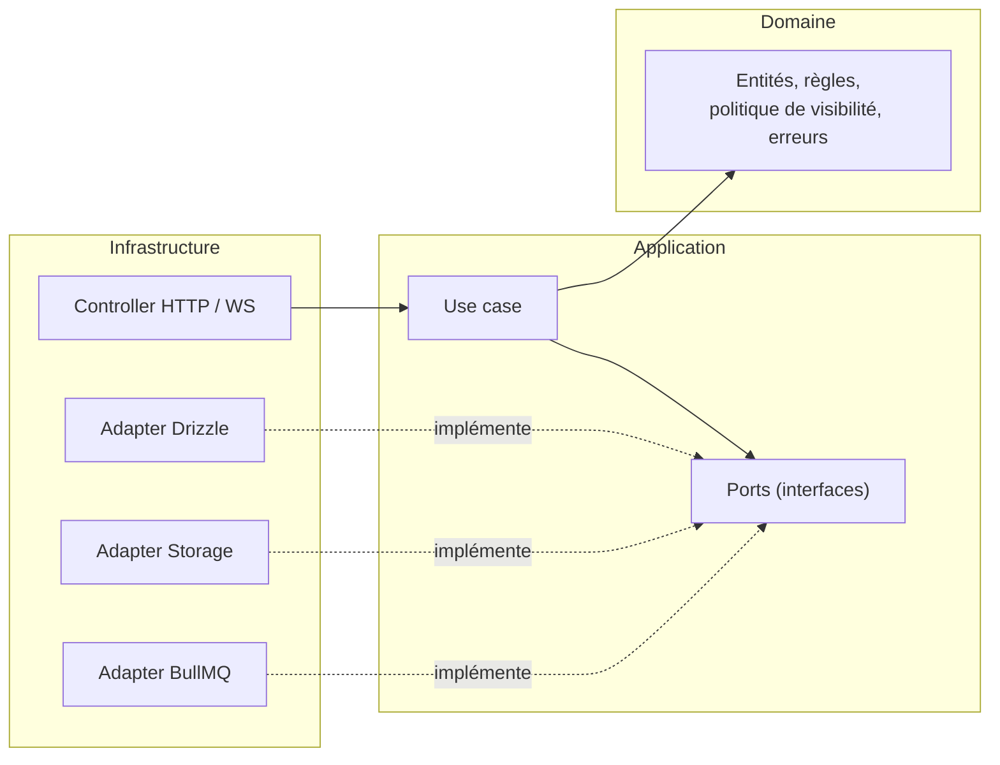

# 06 — Backend (API + worker)

## 1. Stack

| Besoin | Choix | Justification |
|---|---|---|
| Runtime | Node.js LTS + TypeScript (`strict`) | Langage déjà maîtrisé ; un seul langage côté serveur et backoffice |
| Framework HTTP | Fastify | Léger, rapide, WebSocket via `@fastify/websocket`, logs pino intégrés. Alternative écartée : NestJS (plus lourd, décorateurs) |
| Contrat | OpenAPI + `openapi-typescript` | Types générés depuis la spec |
| Validation | Schémas issus de la spec (ou Zod) | Entrées invalides rejetées à la frontière |
| Base de données | Postgres (Supabase local) + extension `pg_trgm` | — |
| Accès base | Drizzle ORM + drizzle-kit | Proche du SQL, typé, migrations versionnées |
| Authentification | Supabase Auth ; vérification de la signature du JWT par l'API | — |
| Stockage | Supabase Storage (API compatible S3), URL d'upload signées | — |
| File de jobs | BullMQ sur Redis | Seul usage de Redis |
| Images | sharp | Redimensionnement, WebP, suppression EXIF |
| Vidéo | ffmpeg / ffprobe | Transcodage HLS, miniature, contrôle de durée |
| Temps réel | `@fastify/websocket` + broker en mémoire | Une instance en local ; port prévu pour Redis pub/sub |
| Rate limiting | `@fastify/rate-limit` (stockage mémoire) | — |
| Logs | pino, JSON structuré, identifiant de requête | Jamais de jeton ni de donnée personnelle dans les logs |
| Tests | Vitest ; Postgres réel pour l'intégration (Supabase local ou Testcontainers) | — |
| Qualité | ESLint, Prettier, `tsc --noEmit`, dependency-cruiser | dependency-cruiser fait respecter l'architecture |

## 2. Architecture hexagonale

### 2.1 Principe



- Le **port** est une interface définie par la couche application (ex. `PostRepository`, `MediaStorage`, `JobQueue`, `RealtimePublisher`, `Clock`, `IdGenerator`).
- L'**adapter** l'implémente (Drizzle, Supabase Storage, BullMQ…).
- Les dépendances pointent toujours vers l'intérieur : le domaine n'importe rien, l'application n'importe que le domaine, l'infrastructure importe tout.

### 2.2 Organisation

```
apps/api/src/
├── modules/
│   ├── identity/
│   ├── social/
│   ├── media/
│   ├── posts/
│   ├── engagement/
│   ├── feed/
│   ├── ephemeral/
│   ├── messaging/
│   ├── activity/
│   ├── moderation/
│   └── <module>/
│       ├── domain/            # entités, règles, erreurs métier — aucun import externe
│       ├── application/
│       │   ├── ports/         # interfaces
│       │   └── use-cases/     # un fichier par use case
│       └── infrastructure/
│           ├── http/          # routes, mapping requête → use case → réponse
│           └── persistence/   # adapters Drizzle
├── shared/
│   ├── domain/                # politique de visibilité, erreurs de base, types communs
│   ├── application/           # ports transverses : UnitOfWork, Clock, IdGenerator, JobQueue, RealtimePublisher
│   └── infrastructure/        # auth JWT, gestion d'erreurs, rate limit, WebSocket, config
└── main.ts                    # composition root : assemblage manuel des dépendances
```

### 2.3 Règles

| Règle | Détail |
|---|---|
| Un use case = une intention | `CreatePost`, `LikePost`, `FollowUser`… ; entrée et sortie typées, sans objet HTTP |
| Autorisation dans les use cases | Le contrôleur authentifie ; le use case décide (propriétaire, rôle admin, visibilité) |
| Politique de visibilité unique | Tous les use cases de lecture passent par `shared/domain/visibility` |
| Transactions | Port `UnitOfWork` : `uow.run(async (tx) => …)` pour tout use case qui écrit dans plusieurs tables (post + compteur + notification) |
| Erreurs | Erreurs métier typées (`NotFound`, `Forbidden`, `Conflict`, `BusinessRule`) converties en *Problem Details* par un gestionnaire unique |
| Pas de domaine riche sans raison | Un like n'a pas besoin d'entité ni de mapper ; un post, un média ou une conversation, oui |
| Injection manuelle | Pas de conteneur DI ; tout est assemblé dans `main.ts` |
| Contrôle automatique | dependency-cruiser fait échouer la CI si `domain/` importe `application/` ou `infrastructure/`, ou si `application/` importe `infrastructure/` |

### 2.4 Exemple de flux : liker un post

1. La route `PUT /v1/posts/:id/like` valide la requête et récupère l'utilisateur authentifié.
2. Le use case `LikePost` charge le post, vérifie `canViewContent`, puis, dans une transaction :
   - insère dans `post_likes` (aucun effet si déjà liké) ;
   - incrémente `posts.like_count` si une ligne a été insérée ;
   - crée une notification pour l'auteur (sauf si c'est soi-même).
3. Le use case renvoie le nouvel état `{ liked: true, likeCount }` ; la route le sérialise selon le contrat.

## 3. Worker

- Processus séparé (`apps/worker`), même monorepo.
- **Pas de logique métier** : il traite des fichiers et met à jour les statuts via les fonctions de transition partagées de `packages/db` (mises à jour conditionnelles, voir 03 § 4.4).

| File | Job | Rôle |
|---|---|---|
| `media` | `process-image` | Détecte le type réel, refuse les fichiers invalides, génère les variantes WebP sans EXIF |
| `media` | `process-video` | `ffprobe` (durée ≤ 60 s, flux vidéo présent), HLS 360p / 720p, miniature |
| `maintenance` | `purge-orphan-media` | Médias non attachés depuis plus de 24 h |
| `maintenance` | `purge-account` | Données et fichiers d'un compte supprimé |
| `maintenance` | `purge-content-files` | Fichiers d'un contenu supprimé par modération |
| `maintenance` | `purge-instants` (P3) | Instants ouverts par tous ou expirés |
| `push` | `send-push` (P2) | Envoi APNs |

Paramètres : 3 tentatives avec délai croissant, concurrence de 1 pour la vidéo (CPU), jobs idempotents (un job rejoué ne produit pas de doublon).

Les jobs `process-image` et `process-video` renvoient `{ mediaId, ownerId }` comme valeur de retour. Ils ne connaissent ni le WebSocket ni ses destinataires.

### 3.1 Notification de fin de traitement (adapter QueueEvents, P1)

L'API notifie le propriétaire d'un média dès la fin de son traitement, sans polling et sans nouvelle brique d'infrastructure.

| Élément | Règle |
|---|---|
| Emplacement | Adapter d'infrastructure de l'API (module `media`), assemblé dans `main.ts`. Aucune logique ajoutée au domaine ni au worker |
| Abonnement | Au démarrage de l'API : `QueueEvents` BullMQ sur la file `media`, événements `completed` et `failed` |
| `completed` | Lit `{ mediaId, ownerId }` dans la valeur de retour, charge les variantes du média, publie `media.ready { mediaId, variants }` |
| `failed` | Retrouve le média et son propriétaire (pas de valeur de retour en cas d'échec), publie `media.failed { mediaId, reason }` avec le `failure_reason` enregistré |
| Diffusion | Via le port existant `RealtimePublisher`, vers le seul propriétaire du média |
| Destinataire non connecté | L'événement est simplement perdu ; le repli `GET /v1/media/{id}` couvre ce cas. Pas de file d'attente ni de stockage des événements |
| Source de vérité | Le statut en base. L'événement ne sert qu'à éviter le polling |

⚠️ À vérifier : avec 3 tentatives, n'émettre `media.failed` qu'à l'échec définitif (média effectivement `failed` en base), pas à chaque tentative ratée.

## 4. Stockage

| Bucket | Accès | Contenu |
|---|---|---|
| `uploads` | Privé | Originaux téléversés |
| `media-public` | Public, chemins UUID | Variantes et HLS des posts, reels, stories, avatars |
| `media-private` | Privé, URL signées courtes | Images de messages, instants |

Limite assumée : le HLS d'un compte privé reste accessible à qui possède l'URL exacte (voir 09).

## 5. Base de données

- Schéma défini dans `packages/db` (Drizzle), partagé par l'API et le worker.
- **Migrations uniquement via drizzle-kit**, versionnées. Aucune modification de schéma depuis le Studio Supabase.
- RLS activé **sans policy** sur toutes les tables (ou exposition du schéma désactivée), voir 02 § 2.
- Script de **seed** : une centaine d'utilisateurs, relations d'abonnement, posts avec images d'exemple, pour tester le feed et valider les index avec `EXPLAIN ANALYZE`.

## 6. Configuration

Variables d'environnement (valeurs dans `.env`, jamais versionnées) :

| Variable | Utilisée par |
|---|---|
| `DATABASE_URL` | API, worker |
| `SUPABASE_URL` | API, worker |
| `SUPABASE_SERVICE_ROLE_KEY` | API, worker |
| `SUPABASE_JWT_ISSUER` / clés de vérification | API |
| `REDIS_URL` | API, worker |
| `PUBLIC_MEDIA_BASE_URL` | API (URL joignable depuis l'iPhone) |
| `API_PORT`, `LOG_LEVEL` | API |
| `APNS_*` (P2) | Worker |

La configuration est validée au démarrage : l'API refuse de démarrer si une variable manque.

## 7. Tests

| Niveau | Outil | Contenu |
|---|---|---|
| Domaine | Vitest | Règles pures (visibilité, transitions de statut, validation des usernames) |
| Use cases | Vitest + adapters en mémoire | Scénarios métier sans base : blocage, compte privé, idempotence, compteurs |
| Adapters | Vitest + Postgres réel | Requêtes Drizzle, contraintes, pagination par curseur |
| API | Vitest + `fastify.inject` | Contrat respecté, codes d'erreur, authentification, rôle admin |
| Worker | Vitest + fichiers d'exemple | Image avec EXIF GPS → sortie sans EXIF ; vidéo trop longue → `failed` |

Cas limites obligatoires : utilisateur bloqué, compte privé non suivi, compte suspendu, double like, message envoyé deux fois avec le même `clientId`, média d'un autre utilisateur, transition de statut invalide, curseur invalide.
